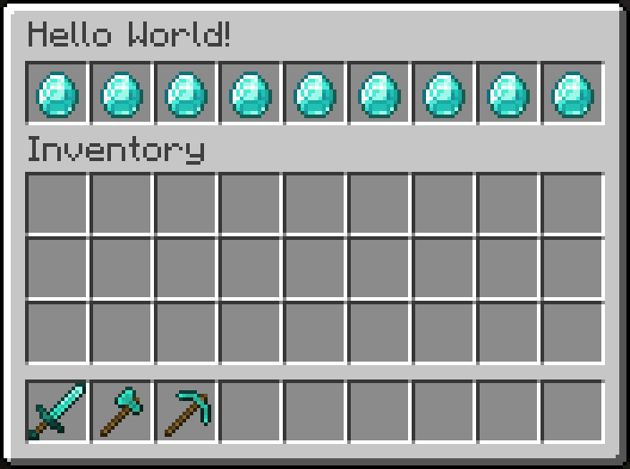

# Quick Overview

In InvUI, there are four main concepts that you need to understand in order to create your own menus:

* [Window](window.md): A window is what you may think of as an "inventory", "menu", or "screen". It is the opened menu that a player sees. Windows always encompasses both the upper and lower (player) inventory. The actual slots of the window are defined by [Guis](gui.md).
* [Gui](gui.md): A Gui is a rectangular arrangement of slots that can contain [Items](item.md).
* [Item](item.md): An item is a single UI element that is visually represented by an `ItemProvider`. Items handle the click actions and can change their appearance (the `ItemmProvider` with which they are presented by) dynamically.
* `ItemProvider`: An item provider is basically just an `ItemStack`, except that they support localization into the viewing player's language. You can use InvUI's built-in `ItemBuilder` as an item provider, or just wrap any `ItemStack` using `ItemWrapper`.

To create a menu, you need to combine all of these concepts:

=== "Kotlin"

    ```kotlin
    // item: a (clickable) ui element
    val helloWorldItem: Item = Item.builder()
        .setItemProvider(ItemBuilder(Material.DIAMOND)) // the item is represented by a diamond (ItemBuilder acts as ItemProvider)
        .addClickHandler { _, _ -> println("Hello World!") } // "Hello World" is printed to the console on click
        .build()
    
    // gui: a rectangular arrangemment of ui elements
    val gui: Gui = Gui.builder()
        .setStructure("x x x x x x x x x") // the gui is of dimensions 9x1 and uses the item 'x' everywhere
        .addIngredient('x', helloWorldItem) // by item 'x', we mean helloWorldItem
        .build()
    
    // window: the menu that is shown to the player, containing the gui(s), which contain the item(s)
    val window: Window = Window.builder()
        .setTitle("Hello World!")
        .setUpperGui(gui)
        .setViewer(player)
        .build()

    window.open(player)
    ```

=== "Java"

    ```java
    ```

{width=500}

The following pages will take a deeper look at [items](item.md), [guis](gui.md), [windows](window.md) and also additional concepts like [inventories](inventory.md) and [localization](localization.md).