## What is a Window?

In InvUI, windows represent the actual Minecraft inventories that are displayed to the player. Windows are made up of [guis](gui.md), the amount of which varies based on the window type. For example, a normal chest window has two guis: one for the upper and one for the lower inventory. Some window types also have special functionality, like the rename bar in anvil windows or the trade buttons in merchant windows.

**A window can only have one viewer.** This makes localization easy, as up until this point we have dealt with `ItemProviders`, which can return an `ItemStack` based on a locale. Now, the window is the first part in the chain that actually resolves the `ItemStacks` - and as these are translated into a specific language, allowing multiple people to view the same window might cause one of them to see the wrong language.

Every window encompasses both the upper- and the lower inventory (i.e. the player's inventory), even if you don't define a lower gui. However, by default, the lower gui is just a [referencing inventory](inventory.md) to the player's actual inventory. This allows the player to still interact with their inventory contents. When a window is open, InvUI controls the entire view at all times and no interactions are handled by Bukkit.

## Window Types

### Normal Window

The normal window, which can be built using `#!kotlin Window.builder()`, is very flexible in the dimensions of the upper gui. Possible dimensions are: `9x6`, `9x5`, `9x4`, `9x3`, `9x2`, `9x1`, `5x1` and `3x3`. The lower gui is always `9x4`. For upper guis of width `9`, the generic chest inventory is used. `5x1` is a hopper inventory and `3x3` is a dropper inventory.

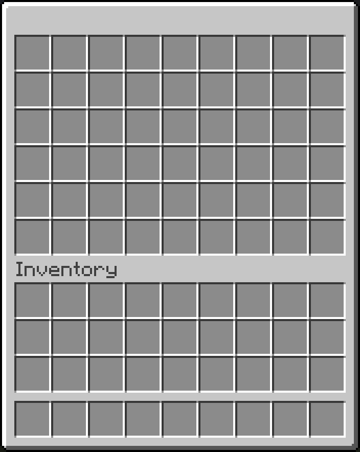{width=100}
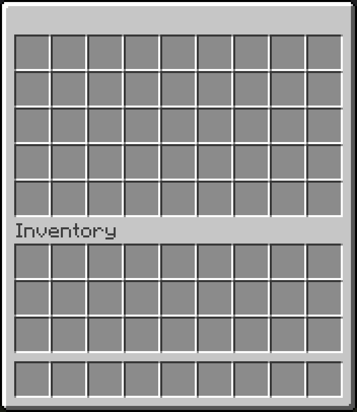{width=100}
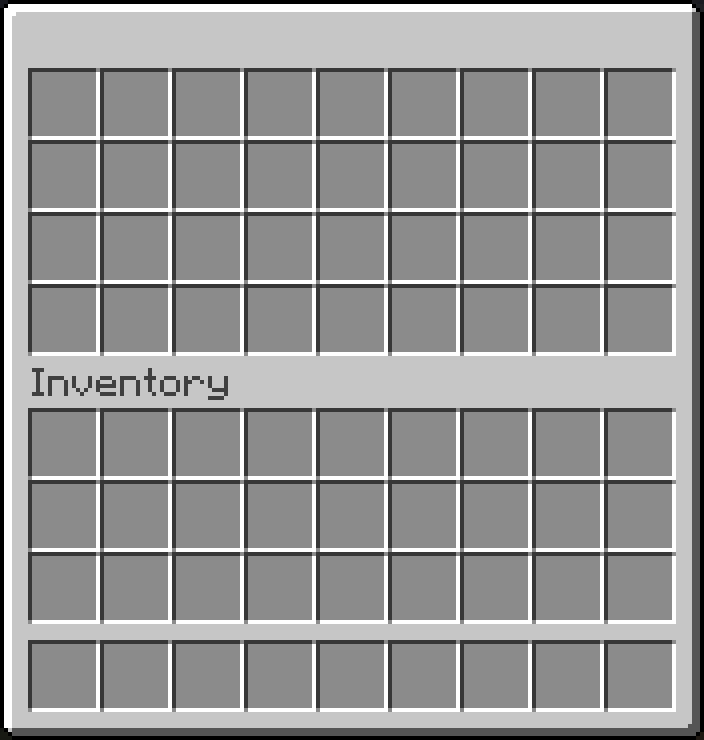{width=100}
{width=100}
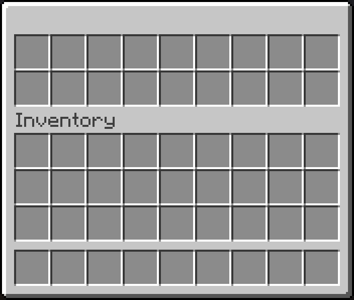{width=100}
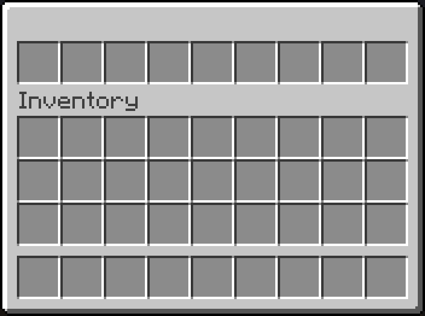{width=100}
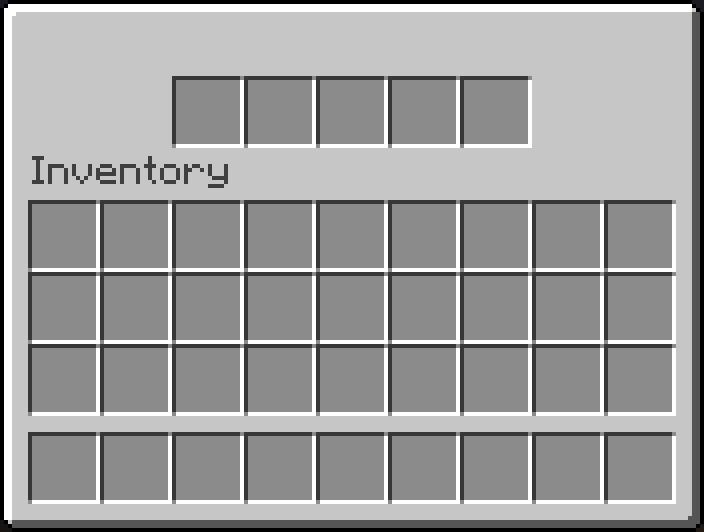{width=100}
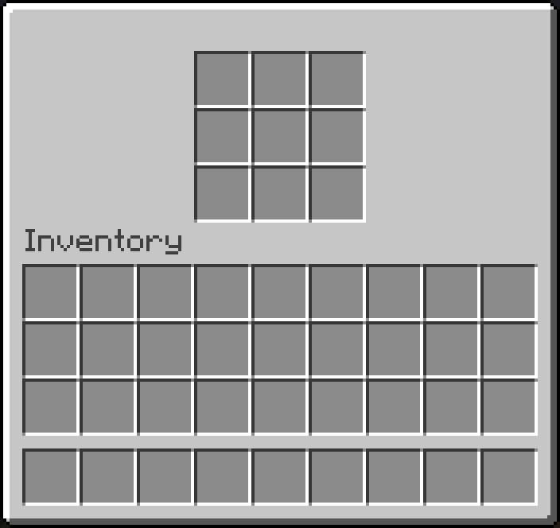{width=100}

The following example creates a window with an upper gui of dimensions `9x6`:

```kotlin
Window.builder()
    .setTitle("Example Window")
    .setUpperGui(Gui.builder()
        .setStructure(
            "# # # # # # # # #",
            "# x x x x x x x #",
            "# x x x x x x x #",
            "# x x x x x x x #",
            "# x x x x x x x #",
            "# # # # # # # # #"
        )
        .addIngredient('#', Item.simple(ItemBuilder(Material.BLACK_STAINED_GLASS_PANE).hideTooltip(true)))
    )
    .open(player)
```

{width=500}

Every window type also allows setting a `lowerGui`, which is the player's inventory. For the normal window, you can also create a `mergedBuilder()`, which accepts a singular gui that is then used for both of what were previously known as the upper and lower guis:


```kotlin
Window.mergedBuilder()
    .setTitle("Example Window")
    .setGui(Gui.builder()
        .setStructure(
            "# # # # # # # # #",
            "# x x x x x x x #",
            "# x x x x x x x #",
            "# x x x x x x x #",
            "# x x x x x x x #",
            "# x x x x x x x #",
            "# x x x x x x x #",
            "# x x x x x x x #",
            "# x x x x x x x #",
            "# # # # # # # # #"
        )
        .addIngredient('#', Item.simple(ItemBuilder(Material.BLACK_STAINED_GLASS_PANE).hideTooltip(true)))
    )
    .open(player)
```

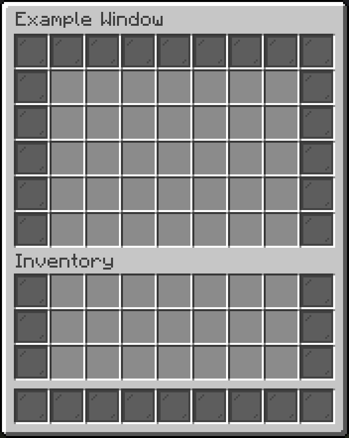{width=500}

### Anvil Window

The anvil window can be created using `#!kotlin AnvilWindow.builder()`. It consists of two guis: the `3x1` upper gui and the `9x4` lower gui. Additionally, the anvil window has a text input field, for which you can register handlers via `addRenameHandler`.

{width=500}

??? example "Example: Anvil-based search window"

    ```kotlin
    fun getItems(search: String): List<Item> =  Material.entries
        .filter { !it.isLegacy && it.isItem }
        .filter { it.name.contains(search, true) }
        .map { Item.simple(ItemBuilder(it)) }
    
    val gui: PagedGui<Item> = PagedGui.itemsBuilder()
        .setStructure(
            "x x x x x x x x x",
            "x x x x x x x x x",
            "x x x x x x x x x",
            "x x x x x x x x x"
        )
        .addIngredient('x', Markers.CONTENT_LIST_SLOT_HORIZONTAL)
        .setContent(getItems(""))
        .build()
    
    AnvilWindow.builder()
        .addRenameHandler { search -> gui.setContent(getItems(search)) }
        .setLowerGui(gui)
        .open(player)
    ```
    
    {width=500}

### Brewing Window

The brewing window can be created using `#!kotlin BrewingWindow.builder()`. It consists of a `1x1` input gui, a `1x1` fuel gui, a `3x1` result gui and a `9x4` lower gui. Additionally, you can control the brew- and fuel progress bars.

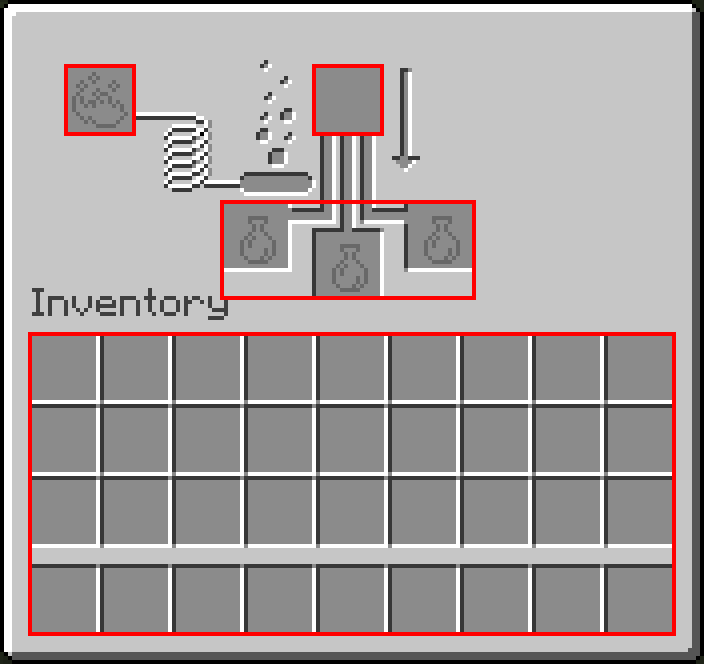{width=500}

### Cartography Window

The cartography window can be created using `#!kotlin CartographyWindow.builder()`. It consists of a `1x2` input gui, a `1x1` result gui and a `9x4` lower gui. The cartography window allows you to render arbitrary `128x128px` images onto the map, as well as place marker icons and switch between the different map view types (duplicate, expand, lock).

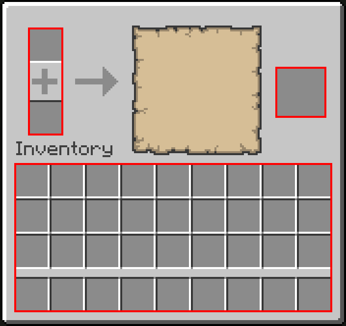{width=500}

??? example "Example: Drawing in the cartography window"

    The following example takes advantage of the fact that bundles select slot `-1` when the mouse cursor leaves them.
    
    ```kotlin
    lateinit var window: CartographyWindow
    
    val img = BufferedImage(128, 128, BufferedImage.TYPE_INT_RGB)
    val lowerGui = Gui.empty(9, 4)
    for (x in 0..<9) {
        for (y in 0..<4) {
            lowerGui[x, y] = Item.builder()
                .setItemProvider {
                    ItemBuilder(Material.BUNDLE)
                        .set(DataComponentTypes.ITEM_MODEL, Key.key("minecraft", "black_stained_glass_pane"))
                        .hideTooltip(true)
                }
                .addBundleSelectHandler { _, _, _ ->
                    val graphics = img.createGraphics()
                    graphics.color = Color.WHITE
                    graphics.fillRect(
                        (x / 9.0 * 128).toInt(),
                        (y / 4.0 * 128).toInt(),
                        ceil(1.0 / 9.0 * 128).toInt(),
                        ceil(1.0 / 4.0 * 128).toInt()
                    )
                    graphics.dispose()
                    window.applyPatch(0, 0, img)
                }
                .build()
        }
    }
    
    val resetItem = Item.builder()
        .setItemProvider(ItemBuilder(Material.BARRIER).setName("<red>Clear"))
        .addClickHandler { _, _ ->
            val graphics = img.createGraphics()
            graphics.color = Color.BLACK
            graphics.fillRect(0, 0, img.width, img.height)
            graphics.dispose()
            window.applyPatch(0, 0, img)
        }.build()
    
    window = CartographyWindow.builder()
        .setViewer(player)
        .setResultGui(Gui.single(resetItem))
        .setLowerGui(lowerGui)
        .build()
    
    window.open()
    ```

    {width=500}

### Crafter Window

The crafter window can be created using `#!kotlin CrafterWindow.builder()`. It consists of a `3x3` crafting gui, a `1x1` result gui and a `9x4` lower gui. The disabled state of the crafting slots can be both server-controlled and used as player input by registering a slot toggle handler via `addSlotToggleHandler`.

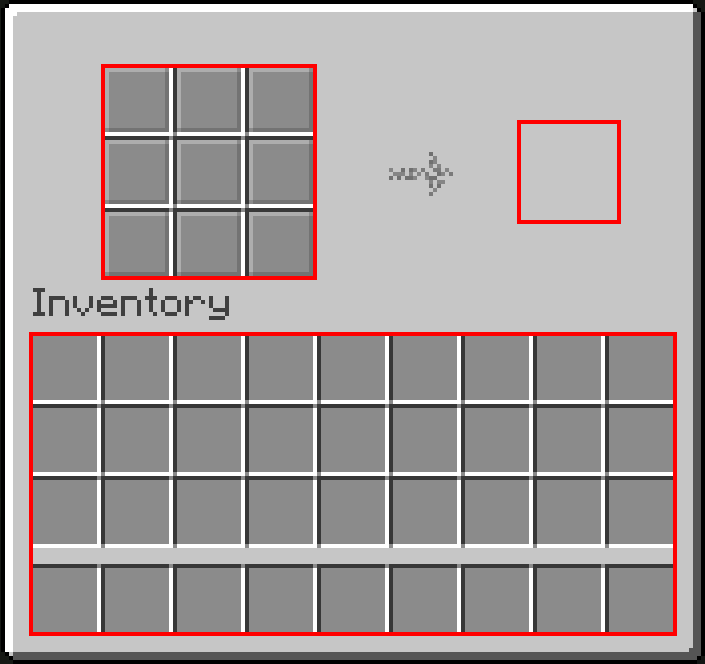{width=500}

### Crafting Window

The crafting window can be created using `#!kotlin CraftingWindow.builder()`. It consists of a `3x3` crafting gui, a `1x1` result gui and a `9x4` lower gui. Clicks in the recipe book can be handled via `addRecipeClickHandler` and ghost recipes can be shown via `sendGhostRecipe`.

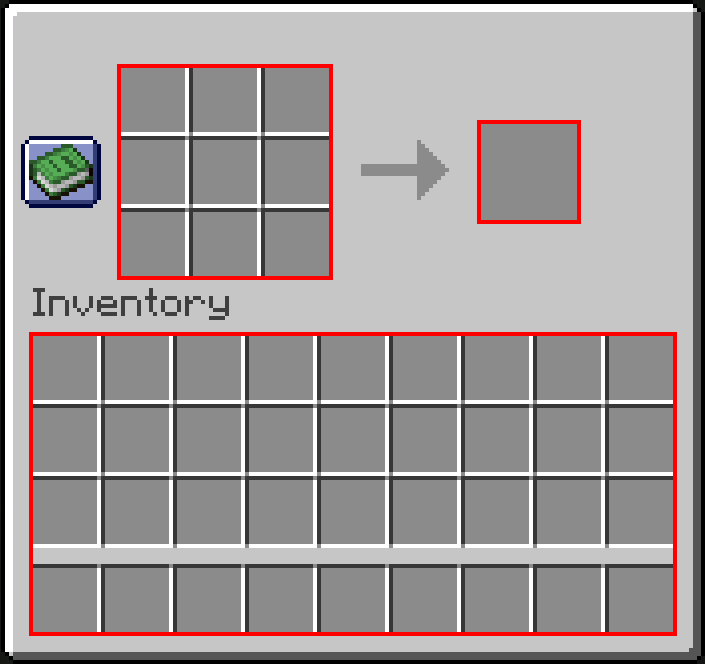{width=500}


??? example "Example: Crafting window that always suggests a diamond hoe"

    The following example registers a recipe click handler that ignores the clicked recipe and always suggests a diamond hoe instead.
    
    ```kotlin
    lateinit var w: CraftingWindow 
    w = CraftingWindow.builder()
        .setCraftingGui(Gui.of(3, 3, VirtualInventory(9)))
        .addRecipeClickHandler { _ -> w.sendGhostRecipe(Key.key("minecraft:diamond_hoe")) }
        .setViewer(player)
        .build()
    w.open()
    ```

    


### Furnace Window

The furnace window can be created using `#!kotlin FurnaceWindow.builder()`. It consists of a `1x2` input gui, a `1x1` result gui and a `9x4` lower gui. Like the crafting window, you can handle recipe clicks via `addRecipeClickHandler` and ghost recipes can be shown via `sendGhostRecipe`. Additionally, you can control the cook and burn progress.

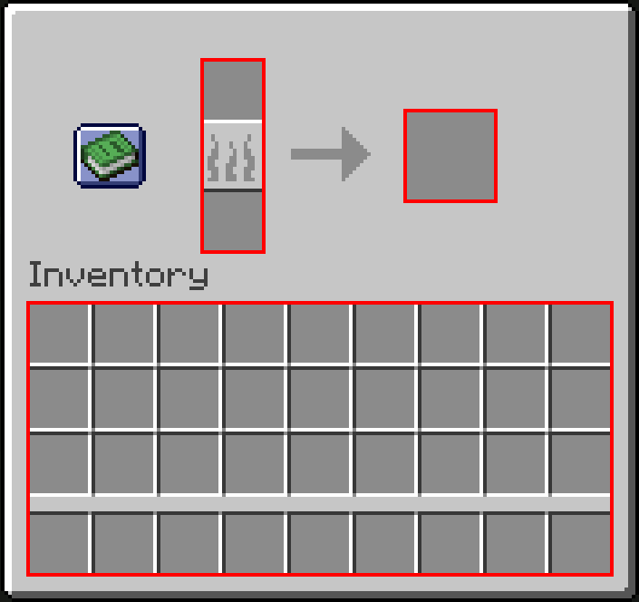{width=500}

### Grindstone Window

The grindstone window can be created using `#!kotlin GrindstoneWindow.builder()`. It consists of a `1x2` input gui, a `1x1` result gui and a `9x4` lower gui.

{width=500}

### Merchant Window

The merchant window can be created using `#!kotlin MerchantWindow.builder()`. It consists of a `3x1` upper gui and a `9x4` lower gui. Additionally, you can define a list of trades that will show up as a scrollable list of buttons on the left side. A trade consists of three [items](item.md) and some additional metadata. When a trade is clicked, the click handlers of all three items are fired.

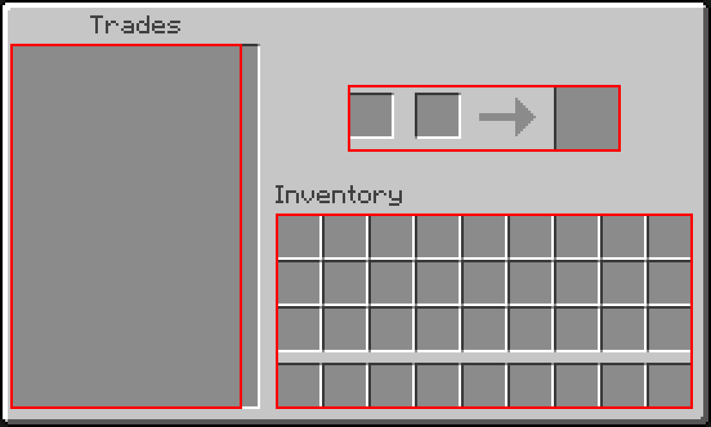{width=500}

??? example "Example: Using trades as tab buttons"

    In the following example, the trade buttons are used to switch the tabs of a [TabGui](gui.md#tab-gui):

    ```kotlin 
    val woolItems: List<ItemStack> = Tag.WOOL.values.map(ItemStack::of)
    
    val tabGui: TabGui = TabGui.builder()
        .setStructure(
            "x x x x x x x x x",
            "x x x x x x x x x",
            "x x x x x x x x x",
            "x x x x x x x x x"
        )
        .addIngredient('x', Markers.CONTENT_LIST_SLOT_HORIZONTAL)
        .setTabs(woolItems.map { Gui.of(9, 4, Item.simple(it)) })
        .build()
    
    val trades: List<MerchantWindow.Trade> = woolItems.mapIndexed { i, woolItem ->
        val tabItem = Item.builder()
            .setItemProvider(woolItem)
            .addClickHandler { _, _ -> tabGui.tab = i }
            .build()
        
        MerchantWindow.Trade.builder()
            .setFirstInput(tabItem)
            .build()
    }
    
    MerchantWindow.builder()
        .setLowerGui(tabGui)
        .setTrades(trades)
        .open(player)
    ```
    
    {width=750}

### Smithing Window

The smithing window can be created using `#!kotlin SmithingWindow.builder()`. It consists of a `4x1` upper gui and a `9x4` lower gui. The item in the rightmost slot is rendered onto the armor stand (either it's equipment or hand item).

{width=500}

### Stonecutter Window

The stonecutter window can be created using `#!kotlin StonecutterWindow.builder()`. It consists of a `2x1` upper gui, a `4xN` buttons gui, where `N` can be any number, and a `9x4` lower gui. You can use the scroll bar to scroll through the buttons. A button can be selected and deselected by both the server and the player. You can register a selection handler via `addSelectedSlotChangeHandler`.

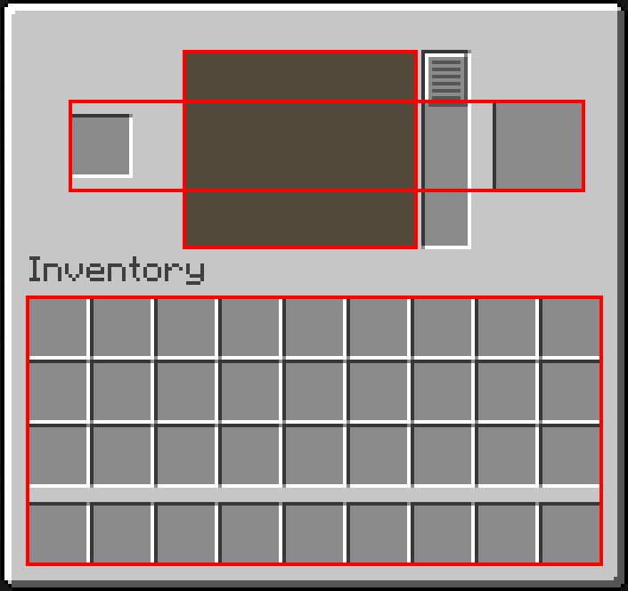{width=500}

??? example "Example: Using the buttons as an inventory"

    The following example embeds a `VirtualInventory` into the buttons gui. Note that updating the buttons resets the scroll bar to the top, so this is not a practical use case.

    ```kotlin
    StonecutterWindow.builder()
        .setButtonsGui(Gui.of(4, 100, VirtualInventory(400)))
        .addModifier { w -> w.addSelectedSlotChangeHandler { _, to -> if (to != -1) w.selectedSlot = -1 } } // (1)!
        .open(player)
    ```
    
    1. This immediately unselects selected buttons.

    {width=500}


## Using the player inventory

As mentioned before, the player inventory is always part of the window and thereby always handled by InvUI, even if you don't define a lower gui. InvUI's windows are also packet-based, which has the following benefits:

* Window items inside the player inventory cannot be accidentally saved to the world and end up in the actual player's inventory.
* UI items in the player inventory cannot trigger advancements.
* The player can still pick up or be given items while a window is open, without them showing up in the lower gui. They will then just be there when the window is closed. (Unless the lower gui just references the player's inventory, in which case they will show up immediately.)

By default, the lower gui is populated by a [referencing inventory](inventory.md) that is configured like this:

```java
Inventory inv = ReferencingInventory.fromPlayerStorageContents(viewer.getInventory());
inv.reverseIterationOrder(OperationCategory.ADD); // shift-clicking moves to bottom right instead of top left
inv.setGuiPriority(OperationCategory.ADD, Integer.MAX_VALUE); // shift-click always moves between upper and lower inv
inv.setGuiPriority(OperationCategory.COLLECT, Integer.MIN_VALUE); // double-click collects from lower inv last
```

However, you can put any `9x4` gui as the lower gui, which will then be used instead of the default one. For example, this can be used to implement a search preview when using an [anvil window](#anvil-window) as text input.


??? example "Example: Using another player's inventory as the lower gui"

    Just for fun, the following example embeds another player's inventory into the lower gui instead of the player's own inventory:
    
    ```kotlin
    val inv = ReferencingInventory.fromPlayerStorageContents(otherPlayer.inventory)
    inv.reverseIterationOrder(OperationCategory.ADD) // shift-clicking moves to bottom right instead of top left
    inv.setGuiPriority(OperationCategory.ADD, Int.MAX_VALUE) // shift-click always moves between upper and lower inv
    inv.setGuiPriority(OperationCategory.COLLECT, Int.MIN_VALUE) // double-click collects from lower inv last
    
    Window.builder()
        .setUpperGui(Gui.empty(5, 1))
        .setLowerGui(Gui.of(9, 4, inv))
        .open(player)
    ```
    
    

## Fallback Window

When designing menus that span multiple windows, it may often make sense to have some way of going back to a previous window. Apart from just adding an item that opens said window, you can also define a window that should be opened when the player closes the window by pressing `E` or `ESC`. This is called the fallback window.

```kotlin
val fallback = CartographyWindow.builder()
    .setViewer(player)
    // no fallback, pressing ESC in cartography window closes it
    .build()
AnvilWindow.builder()
    .setFallbackWindow(fallback) // pressing ESC in anvil window opens cartography window
    .open(player)
```

{width=500}